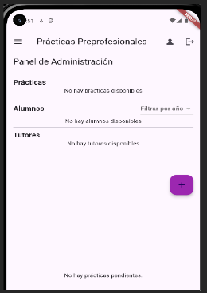
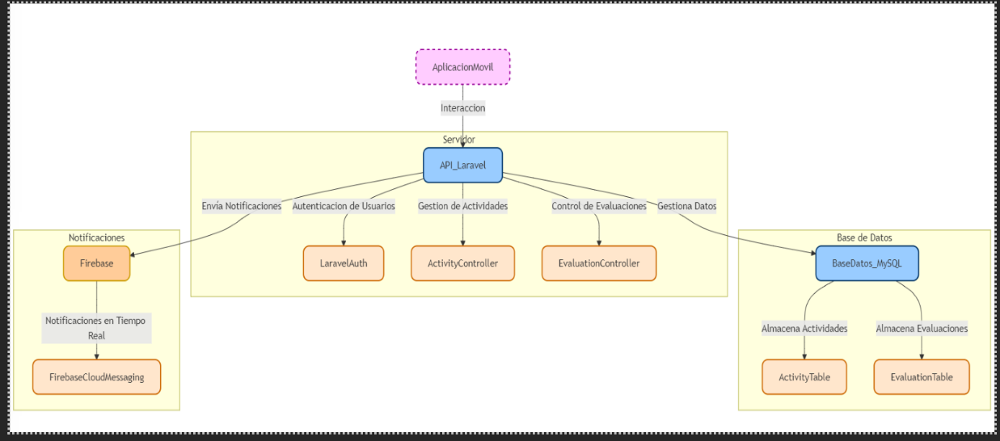
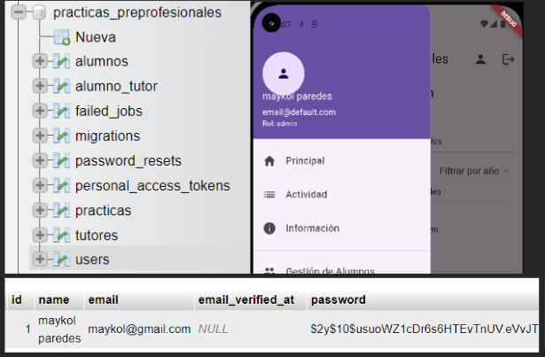

# Proyecto de Prácticas Preprofesionales

## Tabla de Contenidos
1. [Introducción](#introducción)
2. [Arquitectura del Sistema](#arquitectura-del-sistema)
3. [Estructura del Proyecto](#estructura-del-proyecto)
4. [Detalles de los Componentes](#detalles-de-los-componentes)
5. [Cómo Configurar y Ejecutar el Proyecto](#cómo-configurar-y-ejecutar-el-proyecto)
6. [Características Principales](#características-principales)
7. [Diagrama de la Arquitectura](#diagrama-de-la-arquitectura)
8. [Contribuciones](#contribuciones)

---

## Introducción
Este sistema de prácticas preprofesionales está diseñado para gestionar la relación entre alumnos, tutores y las prácticas que realizan. Su objetivo es facilitar la asignación de tutores a alumnos, la creación y aprobación de prácticas, y la subida de evidencias de manera ordenada y eficiente.




El sistema se divide en dos partes:
- **Backend**: Desarrollado en Laravel, sirve como el servidor y proporciona las APIs para interactuar con la base de datos.
- **Frontend**: Aplicación móvil construida con Flutter, que permite a los usuarios interactuar con el sistema de manera intuitiva.


## Arquitectura del Sistema
El sistema sigue una arquitectura cliente-servidor, en la cual la aplicación Flutter (frontend) se comunica con la API Laravel (backend). 

- **Laravel (Backend)**: Gestiona la base de datos y expone las APIs para manejar los datos de alumnos, tutores y prácticas.
- **Flutter (Frontend)**: Interfaz de usuario que permite a los usuarios interactuar con el sistema. Utiliza la librería `http` para conectarse con el backend y el paquete `Provider` para la gestión de estado.
- 



### Componentes de la Arquitectura:
- **Controladores**: Gestionan las solicitudes HTTP y procesan la lógica de negocio.
- **Modelos**: Representan las entidades de la base de datos (Alumno, Tutor, Practica).
- **Servicios**: El servicio de API en Flutter que facilita la comunicación con el backend.

## Estructura del Proyecto

### Backend (Laravel)
- `app/Models`: Contiene los modelos de Laravel para `Alumno`, `Tutor`, y `Practica`.
- `app/Http/Controllers`: Controladores para cada entidad que manejan la lógica de negocio.
- `database/migrations`: Migraciones para crear las tablas en la base de datos.
- `routes/api.php`: Define las rutas de la API para interactuar con el sistema.

### Frontend (Flutter)
- `lib/models`: Modelos de datos que representan las entidades `Alumno`, `Tutor`, y `Practica`.
- `lib/screens`: Pantallas de la aplicación, como `HomeScreen`, `AsignadosScreen`, y `PracticaDetailsScreen`.
- `lib/services`: `ApiService`, que gestiona las solicitudes HTTP hacia el backend.
- `lib/providers`: `UserProvider`, que gestiona el estado de autenticación y roles de usuario.


## Detalles de los Componentes

### Backend
- **AlumnoController**: Gestiona las operaciones CRUD para los alumnos.
- **TutorController**: Maneja la creación, edición y eliminación de tutores.
- **PracticaController**: Administra las prácticas de los alumnos, incluyendo la aprobación, rechazo y subida de evidencia.

### Frontend
- **ApiService**: Servicio que contiene los métodos para realizar solicitudes HTTP al backend.
- **UserProvider**: Proveedor que maneja la información de autenticación y los roles de usuario.
- **Screens**:
  - **HomeScreen**: Pantalla principal que muestra las opciones según el rol del usuario.
  - **AsignadosScreen**: Muestra la lista de tutores asignados a los alumnos.
  - **PracticaDetailsScreen**: Muestra los detalles de una práctica específica y permite subir evidencia.


## Cómo Configurar y Ejecutar el Proyecto

### Requisitos
- **Backend**: PHP 7.4 o superior, Composer, Laravel 8, y MySQL
- **Frontend**: Flutter SDK


### Configuración del Backend
1. Clona el repositorio y accede a la carpeta del proyecto.
   ```bash
   git clone <https://github.com/yucramamanidavid/examen2FlutterAppPracPPP>
   cd backend
   
2. Instala las dependencias con Composer:

  ```bash

  Copiar código
  
  composer install

3. Configura el archivo .env con tus credenciales de base de datos y ejecuta las migraciones:

  ```bash

    Copiar código
    
    php artisan migrate

4. Inicia el servidor de desarrollo de Laravel:

  ```bash
  
  Copiar código
  
  php artisan serve

5.Configuración del Frontend.

Clona el repositorio y accede a la carpeta del proyecto.

  ```bash
  
  Copiar código
  
  git clone <https://github.com/yucramamanidavid/examen2FlutterAppPracPPP>

cd frontend

Instala las dependencias de Flutter:

``bash

Copiar código

flutter pub get

Conecta un dispositivo físico o inicia un emulador, y ejecuta la aplicación:

``bash

Copiar código

flutter run

Características Principales

Asignación de Tutores: Permite asignar tutores a alumnos específicos.

Gestión de Prácticas: Los alumnos pueden crear prácticas y enviarlas para su aprobación.

Aprobación/Rechazo de Prácticas: Los administradores y tutores pueden aprobar o rechazar prácticas de los alumnos.

Subida de Evidencia: Los alumnos pueden subir archivos de evidencia una vez que sus prácticas han sido aprobadas.

Filtro por Año de Ingreso: Permite ver alumnos filtrados por el año de ingreso para una gestión más organizada.

Diagrama de la Arquitectura

El sistema sigue una arquitectura en capas, con las siguientes capas principales:

plaintext

Copiar código

+-------------------------+

|       Flutter UI        |

|   (User Interface)      |

+-----------+-------------+

|

+-----------v-------------+

|      ApiService         |

| (HTTP Requests)         |

+-----------+-------------+

|

+-----------v-------------+

|         Laravel         |

| (API Backend + Database)|

+-------------------------+

Nota: Puedes incluir un diagrama visual detallado si tienes una imagen disponible.

Contribuciones

Agradecemos las contribuciones para mejorar este sistema. Si quieres contribuir, sigue los pasos a continuación:

Haz un fork de este repositorio.

Crea una nueva rama para tu funcionalidad (git checkout -b feature/nueva-funcionalidad).

Realiza tus cambios y haz un commit (git commit -m 'Agrega nueva funcionalidad').

Haz push a la rama (git push origin feature/nueva-funcionalidad).

Crea un Pull Request y describe los cambios que realizaste.
